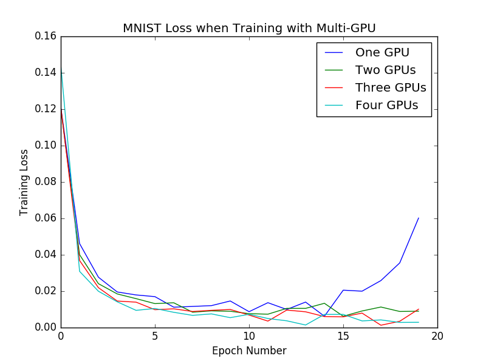
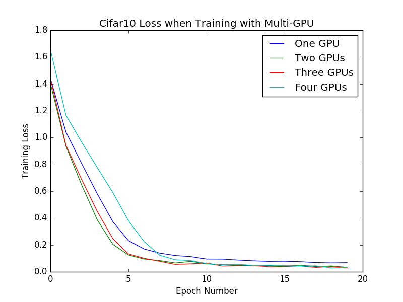
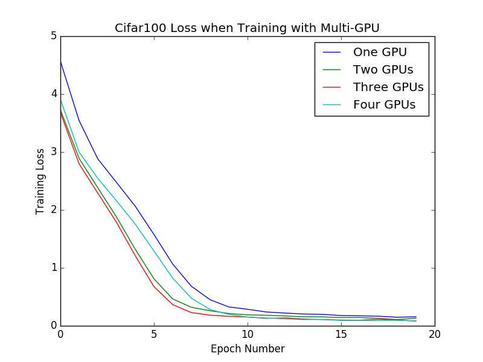

<!-- START doctoc generated TOC please keep comment here to allow auto update -->
<!-- DON'T EDIT THIS SECTION, INSTEAD RE-RUN doctoc TO UPDATE -->


- [Multi-GPU Deep learning with Keras and Tensorflow](#multi-gpu-deep-learning-with-keras-and-tensorflow)
  - [Setup](#setup)
    - [Repo installation](#repo-installation)
    - [Environment Setup](#environment-setup)
  - [Train/Evaluate a model](#trainevaluate-a-model)
    - [Train a model](#train-a-model)
    - [Evaluate a model](#evaluate-a-model)
  - [Results](#results)
  - [Next Steps](#next-steps)

<!-- END doctoc generated TOC please keep comment here to allow auto update -->

# Multi-GPU Deep learning with Keras and Tensorflow

This repository was put together to prototype the (probably) easiest way to perform multi-gpu training using Keras with a Tensorflow backend, and largely just consolidates a couple of different pieces of code that were already available online.

## Setup

### Repo installation

The `multi-gpu-keras-tf` package is pip installable. After cloning the repository, from within the top level directory type:

```bash
pip install multi-gpu-keras-tf
```

*Note*: This will install Keras, but will not install some of the other dependencies that the package depends upon. For a full list, see `environment/environment.yml`.

### Environment Setup

The environment used to develop this repository can be found in `environment/environment.yml`, as can a number of other install files that may be of some use (GPU set up an Ubuntu 14.04 machine, docker env creation, etc.).

## Train/Evaluate a model

### Train a model

*Once the environment is setup and GPU configuration is all set*, you can run the `scripts/train.py` script to train a model on MNIST, Cifar10, or Cifar100. Simply pass in gpu IDs via the `--gpu` flag, a training config via the `--config` flag (see the `example_configs` folder), and an output directory via the `--output_dir` flag. For example, from the top level of the repository, run:

```bash
./scripts/train.py --config example_configs/mnist.yml --gpu_ids 0 1 2 3 --output_dir ~/home/sallamander/mnist
```

This will train an MNIST model on GPUs 0, 1, 2, and 3. *Note* that there might need to be changes made if your GPU setup is different.

### Evaluate a model

**If you used the train script in the repository**, you can evaluate the model by running the `scripts/evaluate.py` script. Simply pass in the output direcory that the model results were saved to:

```bash
./scripts/evaluate.py --model_dir /home/sallamander/mnist
```

*Note*: this does not run on multiple GPUs.

## Results

To prototype multi-GPU training, I tested a single model (VGG) on MNIST, Cifar10, and Cifar100. I verified that the models were able to run on 1, 2, 4, and 8 GPUs, and that they were in fact able to train (see training losses below). I did not pay any attention to the validation losses (or accuracies) and did not try to tune the models, as I've left that for another day.





## Next Steps

For the time being, I don't have any future plans for this repository. However, I could imagine next steps involving building out and testing other models, studying convergence patterns, etc.
